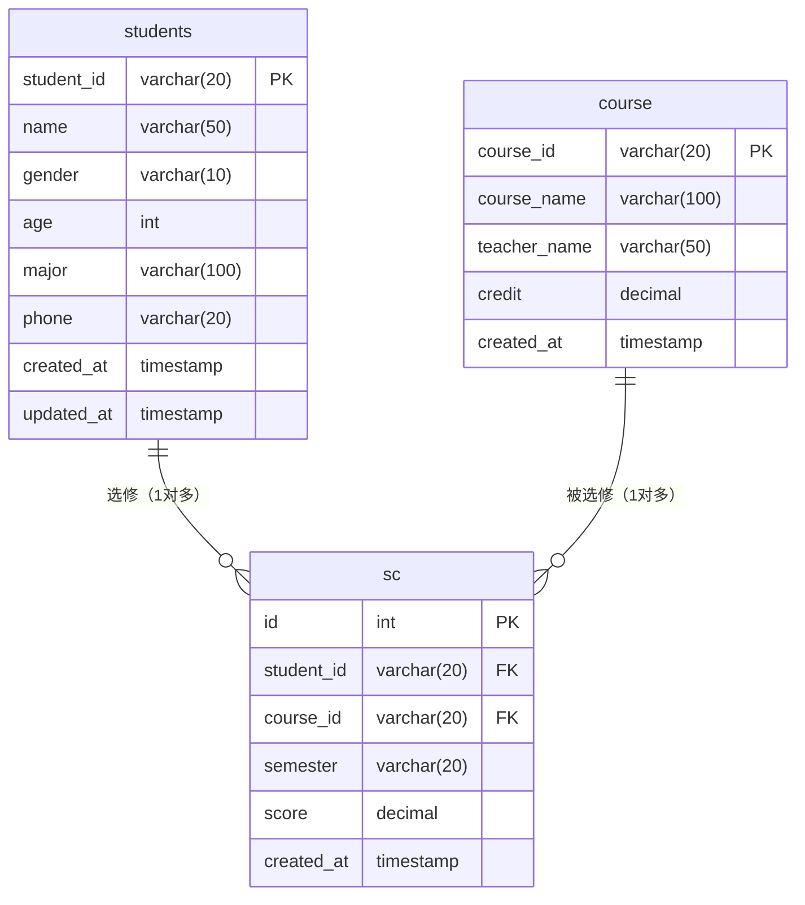

## 一、数据库建表 SQL

```sql
-- 创建数据库
CREATE DATABASE IF NOT EXISTS student_db DEFAULT CHARSET=utf8mb4 COLLATE=utf8mb4_unicode_ci;
USE student_db;

-- 学生表
CREATE TABLE IF NOT EXISTS students (
    student_id VARCHAR(20) PRIMARY KEY,
    name VARCHAR(50) NOT NULL,
    gender ENUM('男', '女', '其他') NOT NULL,
    age INT CHECK (age > 0 AND age < 150),
    major VARCHAR(100),
    phone VARCHAR(20),
    created_at TIMESTAMP DEFAULT CURRENT_TIMESTAMP,
    updated_at TIMESTAMP DEFAULT CURRENT_TIMESTAMP ON UPDATE CURRENT_TIMESTAMP
) ENGINE=InnoDB DEFAULT CHARSET=utf8mb4;

-- 课程表
CREATE TABLE IF NOT EXISTS course (
    course_id VARCHAR(20) PRIMARY KEY,
    course_name VARCHAR(100) NOT NULL,
    teacher_name VARCHAR(50) NOT NULL,
    credit DECIMAL(3,1) NOT NULL,
    created_at TIMESTAMP DEFAULT CURRENT_TIMESTAMP
) ENGINE=InnoDB DEFAULT CHARSET=utf8mb4;

-- 选课表（sc.course_id 使用 RESTRICT：若有学生已选修则拒绝删除课程）
CREATE TABLE IF NOT EXISTS sc (
    id INT AUTO_INCREMENT PRIMARY KEY,
    student_id VARCHAR(20) NOT NULL,
    course_id VARCHAR(20) NOT NULL,
    semester VARCHAR(20) NOT NULL,
    score DECIMAL(5,2) DEFAULT NULL,
    created_at TIMESTAMP DEFAULT CURRENT_TIMESTAMP,
    CONSTRAINT fk_sc_student FOREIGN KEY (student_id)
        REFERENCES students(student_id) ON DELETE CASCADE,
    CONSTRAINT fk_sc_course FOREIGN KEY (course_id)
        REFERENCES course(course_id) ON DELETE RESTRICT,
    CONSTRAINT uk_student_course_semester UNIQUE (student_id, course_id, semester)
) ENGINE=InnoDB DEFAULT CHARSET=utf8mb4;
```

---

# 学生选课管理系统

> 本项目为数据库课程实践项目，用于本科教学演示

## 一、系统概述

本系统是一个简单的学生选课管理系统，实现了学生、课程、选课记录的基本管理功能。通过本项目可以学习：
- 数据库表的设计与关联
- 外键约束与参照完整性
- 级联删除的概念
- SQL 语句的编写
- Python + MySQL 的 CRUD 操作

## 二、功能介绍

### 2.1 学生管理
| 功能 | 说明 |
|------|------|
| 添加学生 | 录入学号、姓名、性别、年龄、专业、电话 |
| 查看所有学生 | 列表展示所有学生信息 |
| 搜索学生 | 按学号或姓名关键词模糊查询 |
| 修改学生信息 | 更新学生的各项信息 |
| 删除学生 | 删除学生及其关联的选课记录（级联删除） |

### 2.2 课程管理
| 功能 | 说明 |
|------|------|
| 添加课程 | 录入课程号、课程名、任课教师、学分 |
| 查看所有课程 | 列表展示所有课程信息 |
| 搜索课程 | 按课程号或课程名关键词模糊查询 |
| 修改课程信息 | 更新课程的各项信息 |
| 删除课程 | 删除课程（若有学生已选修则拒绝删除） |

### 2.3 选课管理
| 功能 | 说明 |
|------|------|
| 学生选课 | 学生选择一门课程（同一学期不能重复选修） |
| 查看学生选课 | 查看某个学生的所有选课记录 |
| 查看所有选课 | 查看系统中所有选课记录 |
| 退课 | 学生退出某门已选课程 |
| 录入/修改成绩 | 为选课记录添加或修改成绩 |

### 2.4 成绩统计
| 功能 | 说明 |
|------|------|
| 查询总学分 | 统计某个学生已获成绩的课程总学分 |
| 查询平均成绩 | 统计某个学生已获成绩课程的平均分 |

## 三、架构设计

### 3.1 项目结构

```
stu_app_v0-3/
├── main.py          # 主程序，系统入口，交互逻辑
├── models.py        # 数据模型类（Student, Course, SC）
├── database.py      # 数据库操作类，SQL 语句封装
├── init_data.py     # 测试数据初始化脚本
├── requirements.txt # Python 依赖
└── README.md        # 项目说明文档
```

### 3.2 模块划分

```
┌─────────────────────────────────────────────┐
│                  main.py                    │
│         （用户交互、业务流程控制）            │
└─────────────────┬───────────────────────────┘
                  │
    ┌─────────────┼─────────────┐
    ▼             ▼             ▼
┌────────┐  ┌──────────┐  ┌─────────┐
│Student │  │  Course  │  │   SC    │
│  类    │  │   类     │  │   类    │
└────────┘  └──────────┘  └─────────┘
    │             │             │
    └─────────────┼─────────────┘
                  ▼
         ┌──────────────┐
         │  database.py │
         │  （数据库操作）│
         └──────┬───────┘
                │
                ▼
         ┌──────────────┐
         │    MySQL     │
         │   数据库      │
         └──────────────┘
```

### 3.3 类说明

| 类名 | 文件 | 说明 |
|------|------|------|
| `Student` | models.py | 学生数据模型 |
| `Course` | models.py | 课程数据模型 |
| `SC` | models.py | 选课记录数据模型（关联学生和课程） |
| `Database` | database.py | 数据库操作类，封装所有 SQL 操作 |
| `StudentCourseSystem` | main.py | 系统主类，处理用户交互 |

## 四、ER 图



**关系说明**：
- `students ↔ sc` ：一对多关系（一个学生可以选多门课）
- `course ↔ sc` ：一对多关系（一门课可以被多个学生选修）
- `sc` 是关联表，连接学生和课程

## 五、数据库设计

### 5.1 students 表（学生表）

| 字段名 | 数据类型 | 约束 | 说明 |
|--------|----------|------|------|
| student_id | VARCHAR(20) | PRIMARY KEY | 学号 |
| name | VARCHAR(50) | NOT NULL | 姓名 |
| gender | ENUM('男','女','其他') | NOT NULL | 性别 |
| age | INT | CHECK (age > 0 AND age < 150) | 年龄 |
| major | VARCHAR(100) | - | 专业 |
| phone | VARCHAR(20) | - | 电话 |
| created_at | TIMESTAMP | DEFAULT CURRENT_TIMESTAMP | 创建时间 |
| updated_at | TIMESTAMP | ON UPDATE CURRENT_TIMESTAMP | 更新时间 |

### 5.2 course 表（课程表）

| 字段名 | 数据类型 | 约束 | 说明 |
|--------|----------|------|------|
| course_id | VARCHAR(20) | PRIMARY KEY | 课程号 |
| course_name | VARCHAR(100) | NOT NULL | 课程名 |
| teacher_name | VARCHAR(50) | NOT NULL | 任课教师 |
| credit | DECIMAL(3,1) | NOT NULL | 学分 |
| created_at | TIMESTAMP | DEFAULT CURRENT_TIMESTAMP | 创建时间 |

### 5.3 sc 表（选课表）

| 字段名 | 数据类型 | 约束 | 说明 |
|--------|----------|------|------|
| id | INT | PRIMARY KEY, AUTO_INCREMENT | 主键 |
| student_id | VARCHAR(20) | FOREIGN KEY → students | 学号 |
| course_id | VARCHAR(20) | FOREIGN KEY → course | 课程号 |
| semester | VARCHAR(20) | NOT NULL | 学期 |
| score | DECIMAL(5,2) | NULL | 成绩（0-100） |
| created_at | TIMESTAMP | DEFAULT CURRENT_TIMESTAMP | 创建时间 |
| - | - | UNIQUE(student_id, course_id, semester) | 唯一约束 |

## 六、数据库完整性

### 6.1 实体完整性

| 表 | 主键 | 说明 |
|----|------|------|
| students | student_id | 每个学生有唯一的学号 |
| course | course_id | 每门课程有唯一的课程号 |
| sc | id | 每条选课记录有唯一的自增 ID |

### 6.2 参照完整性（外键约束）

```sql
-- sc.student_id 参考 students.student_id
CONSTRAINT fk_sc_student FOREIGN KEY (student_id)
    REFERENCES students(student_id) ON DELETE CASCADE

-- sc.course_id 参考 course.course_id（使用 RESTRICT：若有学生已选修则拒绝删除）
CONSTRAINT fk_sc_course FOREIGN KEY (course_id)
    REFERENCES course(course_id) ON DELETE RESTRICT
```

**删除策略说明**：
- 删除学生时：**自动删除**该学生的所有选课记录（CASCADE）
- 删除课程时：**拒绝删除**（RESTRICT），若已有学生选修该课程

### 6.3 域完整性（CHECK 约束）

```sql
-- 学生年龄范围
age INT CHECK (age > 0 AND age < 150)

-- 成绩范围（在业务逻辑中验证：0-100）
```

### 6.4 唯一性约束

```sql
-- 防止学生重复选修同一门课（同一学期）
CONSTRAINT uk_student_course_semester UNIQUE (student_id, course_id, semester)
```

### 6.5 业务规则

| 规则 | 实现方式 |
|------|----------|
| 同一学生同一学期不能选修同一门课 | 唯一约束 (student_id, course_id, semester) |
| 成绩可以有值也可以为空 | score 字段允许 NULL |
| 删除课程时若有学生已选修则不能删除 | 外键约束保护，或业务逻辑检查 |
| 总学分只统计有成绩的课程 | SQL 条件 `WHERE score IS NOT NULL` |
| 平均成绩只统计有成绩的课程 | SQL 条件 `WHERE score IS NOT NULL` |

## 七、快速开始

### 7.1 环境要求

- Python 3.8+
- MySQL 5.7+ 或 MySQL 8.0+

### 7.2 安装依赖

```bash
pip install mysql-connector-python
```

### 7.3 配置数据库连接

编辑 `main.py` 底部的数据库连接参数：

```python
system = StudentCourseSystem(
    host='localhost',
    database='student_db',
    user='your_username',
    password='your_password'
)
```

### 7.4 初始化测试数据

```bash
python init_data.py
```

该脚本会：
1. 删除旧表（如果存在）
2. 创建新表
3. 插入 4 名学生、6 门课程、15 条选课记录
4. 录入部分成绩
5. 显示统计信息

### 7.5 运行系统

```bash
python main.py
```

## 八、菜单说明

```
=======================================================
               🎓 学生选课管理系统
=======================================================
  【学生管理】
  1. 添加学生
  2. 查看所有学生
  3. 搜索学生
  4. 修改学生信息
  5. 删除学生

  【课程管理】
  6. 添加课程
  7. 查看所有课程
  8. 搜索课程
  9. 修改课程信息
  10. 删除课程

  【选课管理】
  11. 学生选课
  12. 查看某学生选课情况
  13. 查看所有选课记录
  14. 退课
  15. 录入/修改成绩

  【成绩统计】
  16. 查询学生总学分
  17. 查询学生平均成绩

  0. 退出系统
=======================================================
```

## 九、常见操作示例

### 9.1 添加学生
```
请选择操作（输入数字）：1
请输入学号：2024005
请输入姓名：李明
请输入性别（男/女/其他）：男
请输入年龄：19
请输入专业：软件工程
请输入电话：13900139000
✅ 学生 李明 添加成功
```

### 9.2 添加课程
```
请选择操作（输入数字）：6
请输入课程号：CS105
请输入课程名：软件工程导论
请输入任课教师：杨老师
请输入学分：2.0
✅ 课程 软件工程导论 添加成功
```

### 9.3 学生选课
```
请选择操作（输入数字）：11
请输入学号：2024005

可选课程列表：

课程号        课程名               任课教师         学分
------------------------------------------------------------
CS101       数据结构              李老师          3.0
CS102       操作系统              王老师          3.0
...

请输入要选修的课程号：CS101
请输入学期（如：2024-1、2024-2）：2024-2
✅ 选课成功：2024005 - CS101
```

### 9.4 录入成绩
```
请选择操作（输入数字）：15
请输入学号：2024001
请输入课程号：CS101
请输入学期：2024-1
请输入成绩（0-100，直接回车留空）：85
✅ 成绩录入/修改成功：2024001 - CS101 - 2024-1 = 85.0
```

### 9.5 查询统计
```
请选择操作（输入数字）：16
请输入学号：2024001
📊 学生 2024001 的总学分：15.5
```

## 十、实验思考题

1. **外键约束**：如果删除一个已有选课记录的学生，会发生什么？
2. **唯一约束**：尝试让同一个学生同一学期重复选修同一门课程，观察错误信息
3. **级联删除**：删除一门课程和删除一个学生，有什么不同的处理方式？
4. **NULL 值处理**：为什么总学分和平均成绩的统计要排除 score 为 NULL 的记录？
5. **数据一致性**：如果 sc 表不存储 course_name 和 teacher_name，会有什么问题？

## 十二、数据库建表语句（供参考）- 旧版（见第一节）

```sql
-- 学生表
CREATE TABLE students (
    student_id VARCHAR(20) PRIMARY KEY,
    name VARCHAR(50) NOT NULL,
    gender ENUM('男', '女', '其他') NOT NULL,
    age INT CHECK (age > 0 AND age < 150),
    major VARCHAR(100),
    phone VARCHAR(20),
    created_at TIMESTAMP DEFAULT CURRENT_TIMESTAMP,
    updated_at TIMESTAMP DEFAULT CURRENT_TIMESTAMP ON UPDATE CURRENT_TIMESTAMP
) ENGINE=InnoDB DEFAULT CHARSET=utf8mb4;

-- 课程表
CREATE TABLE course (
    course_id VARCHAR(20) PRIMARY KEY,
    course_name VARCHAR(100) NOT NULL,
    teacher_name VARCHAR(50) NOT NULL,
    credit DECIMAL(3,1) NOT NULL,
    created_at TIMESTAMP DEFAULT CURRENT_TIMESTAMP
) ENGINE=InnoDB DEFAULT CHARSET=utf8mb4;

-- 选课表
CREATE TABLE sc (
    id INT AUTO_INCREMENT PRIMARY KEY,
    student_id VARCHAR(20) NOT NULL,
    course_id VARCHAR(20) NOT NULL,
    semester VARCHAR(20) NOT NULL,
    score DECIMAL(5,2) DEFAULT NULL,
    created_at TIMESTAMP DEFAULT CURRENT_TIMESTAMP,
    CONSTRAINT fk_sc_student FOREIGN KEY (student_id)
        REFERENCES students(student_id) ON DELETE CASCADE,
    CONSTRAINT fk_sc_course FOREIGN KEY (course_id)
        REFERENCES course(course_id) ON DELETE RESTRICT,
    CONSTRAINT uk_student_course_semester UNIQUE (student_id, course_id, semester)
) ENGINE=InnoDB DEFAULT CHARSET=utf8mb4;
```

---

## 十三、课后作业

### 作业要求：补充教师信息管理模块

#### 1. 背景说明

当前系统中，课程表 `course` 的 `teacher_name` 只是普通文本字段，存在以下问题：
- 同一教师的信息（如电话、职称等）分散在不同的课程记录中
- 无法方便地查询某位教师教授的所有课程
- 教师信息无法复用

#### 2. 任务内容

在现有系统基础上，补充完整的教师信息管理模块，具体要求如下：

**（1）新增教师表 `teacher`**

| 字段名 | 数据类型 | 约束 | 说明 |
|--------|----------|------|------|
| teacher_id | VARCHAR(20) | PRIMARY KEY | 教师编号 |
| name | VARCHAR(50) | NOT NULL | 姓名 |
| gender | ENUM('男','女','其他') | NOT NULL | 性别 |
| age | INT | CHECK (age > 0 AND age < 150) | 年龄 |
| title | VARCHAR(50) | - | 职称（教授/副教授/讲师等） |
| phone | VARCHAR(20) | - | 电话 |
| created_at | TIMESTAMP | DEFAULT CURRENT_TIMESTAMP | 创建时间 |

**（2）修改课程表 `course`**

将 `teacher_name VARCHAR(50) NOT NULL` 替换为 `teacher_id VARCHAR(20) NOT NULL`，并添加外键约束：
```sql
CONSTRAINT fk_course_teacher FOREIGN KEY (teacher_id)
    REFERENCES teacher(teacher_id) ON DELETE CASCADE
```

**（3）实现教师管理功能（在 main.py 中补充）**

| 功能 | 说明 |
|------|------|
| 添加教师 | 录入教师编号、姓名、性别、年龄、职称、电话 |
| 查看所有教师 | 列表展示所有教师信息 |
| 搜索教师 | 按教师编号或姓名关键词模糊查询 |
| 修改教师信息 | 更新教师的各项信息 |
| 删除教师 | 删除教师（若该教师有课程则级联删除课程） |

**（4）修改课程管理相关功能**

- 添加课程时，由用户选择授课教师（从已有教师列表中选择）
- 查看/搜索课程时，显示授课教师姓名而非教师编号
- 删除教师时，该教师的所有课程自动被删除（级联删除）

#### 3. 实现提示

1. 在 `models.py` 中新增 `Teacher` 类
2. 在 `database.py` 中：
   - 新增 `create_teacher_table()` 方法
   - 新增 `add_teacher()` / `get_all_teachers()` / `search_teachers()` / `update_teacher()` / `delete_teacher()` 方法
   - 修改 `create_course_query`，将 `teacher_name` 改为 `teacher_id` 并添加外键
   - 修改 `add_course()` / `search_courses()` / `get_all_courses()` 等方法，适配新的课程表结构
3. 在 `main.py` 中新增教师管理菜单和相关处理逻辑
4. 修改 `init_data.py`，补充教师测试数据
5. 将最终结果截图上传到课件系统（包括建表所有SQL，插入对应课程信息表里面的教师信息，还有mysqlworkench 里面实体联系图，更新README.md）

#### 4. 思考题

1. 删除一位教师时，其教授的课程也会被删除，那么这些课程关联的选课记录会如何处理？
2. 如果希望删除教师时保留课程（只解除关联关系），应该如何修改外键约束？
3. 如何保证不会出现"孤立的课程"（即没有授课教师的课程）？
