# DB08：关系数据库存储技术

> 这一讲我们用“图书馆、快递柜、通讯录”等生活例子，配上图表，彻底搞懂数据库到底是怎么存数据、怎么加速查询的。

---

## 一、为什么数据库需要“存储技术”？

### 1.1 一个真实场景

假设你开了一家淘宝店，每天：

| 操作 | 频率 |
|------|------|
| 用户下单 | 1000次 |
| 查询订单 | 5000次 |
| 修改地址 | 200次 |
| 退款 | 50次 |

如果数据乱放，结果就是：**越来越慢，越来越卡**。

### 1.2 数据库要解决的三个核心问题
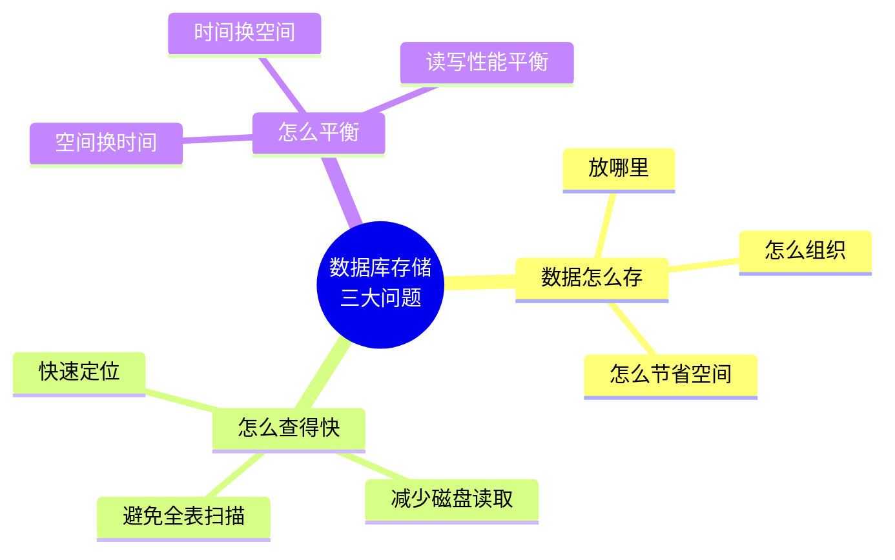

---

## 二、逻辑结构 vs 物理结构（必考重点）

### 2.1 你看到的 vs 电脑存的

| 维度 | 逻辑结构（你看到的） | 物理结构（电脑存的） |
|------|---------------------|---------------------|
| 层次 | 数据库 → 表 → 行 → 列 | 文件 → 块 → 记录 |
| 例子 | `SELECT * FROM Student` | 硬盘上的二进制数据 |
| 特点 | 抽象、方便理解 | 具体、讲究效率 |

### 2.2 对应关系图

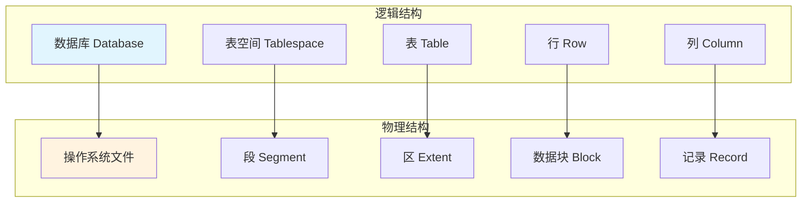

---

## 三、数据库的两种存储方式

### 3.1 方式对比表（含 MySQL）

| 对比项 | 方式一：一表一文件 | 方式二：DBMS自管理 | **MySQL（InnoDB）** |
|--------|-------------------|-------------------|---------------------|
| 代表 | PostgreSQL、KingbaseES | Oracle、SQL Server | **MySQL（InnoDB引擎）** |
| 管理方式 | 每个表一个独立文件 | 一个大文件，DBMS自己划分 | **每个表一个独立文件 + 共享表空间（可选）** |
| 优点 | 简单、直观、易备份 | 性能高、灵活 | **兼顾两者优点，灵活可配** |
| 缺点 | 文件太多，系统压力大 | 崩溃恢复复杂 | 配置复杂，需理解两种模式 |
| 形象比喻 | 每个人住自己房子 | 整栋公寓，统一管理 | **可以独栋，也可以合租** |

---

### 3.2 示意图（含 MySQL）

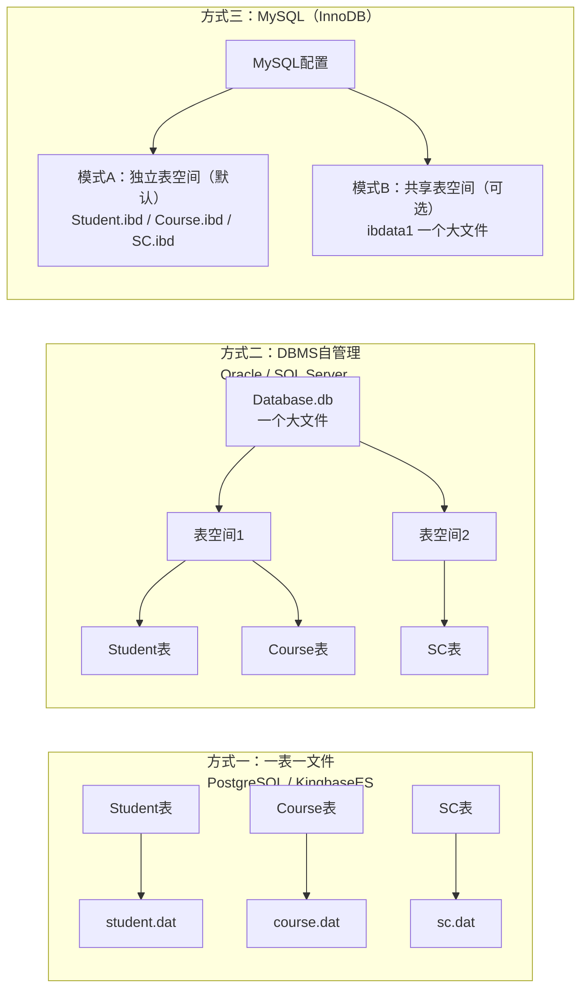

---

### 3.3 MySQL InnoDB 的两种模式详解

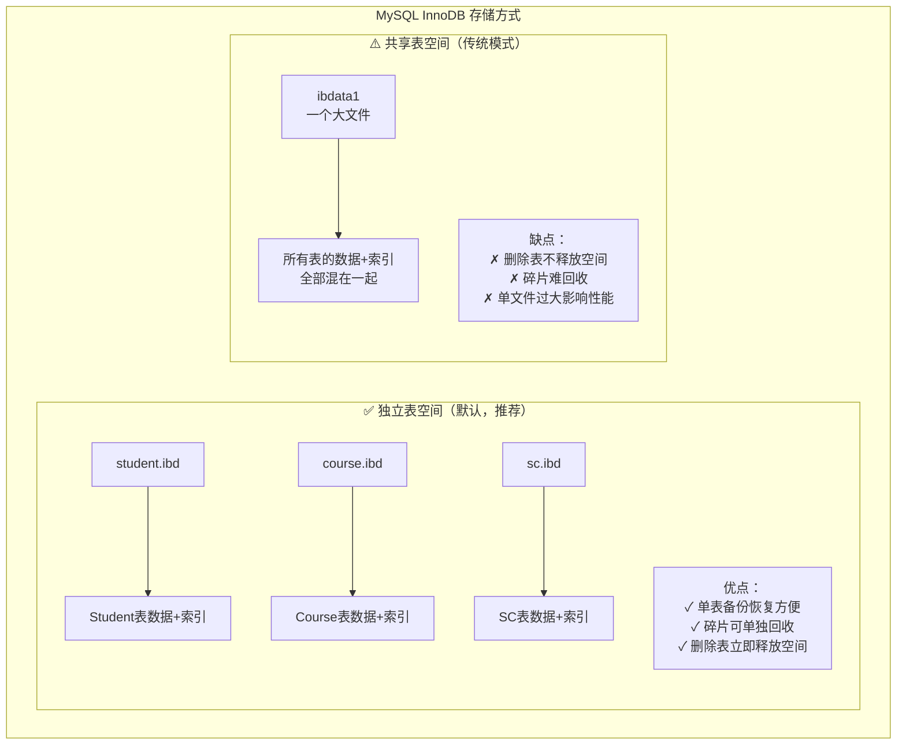

---

### 3.4 MySQL 配置方式

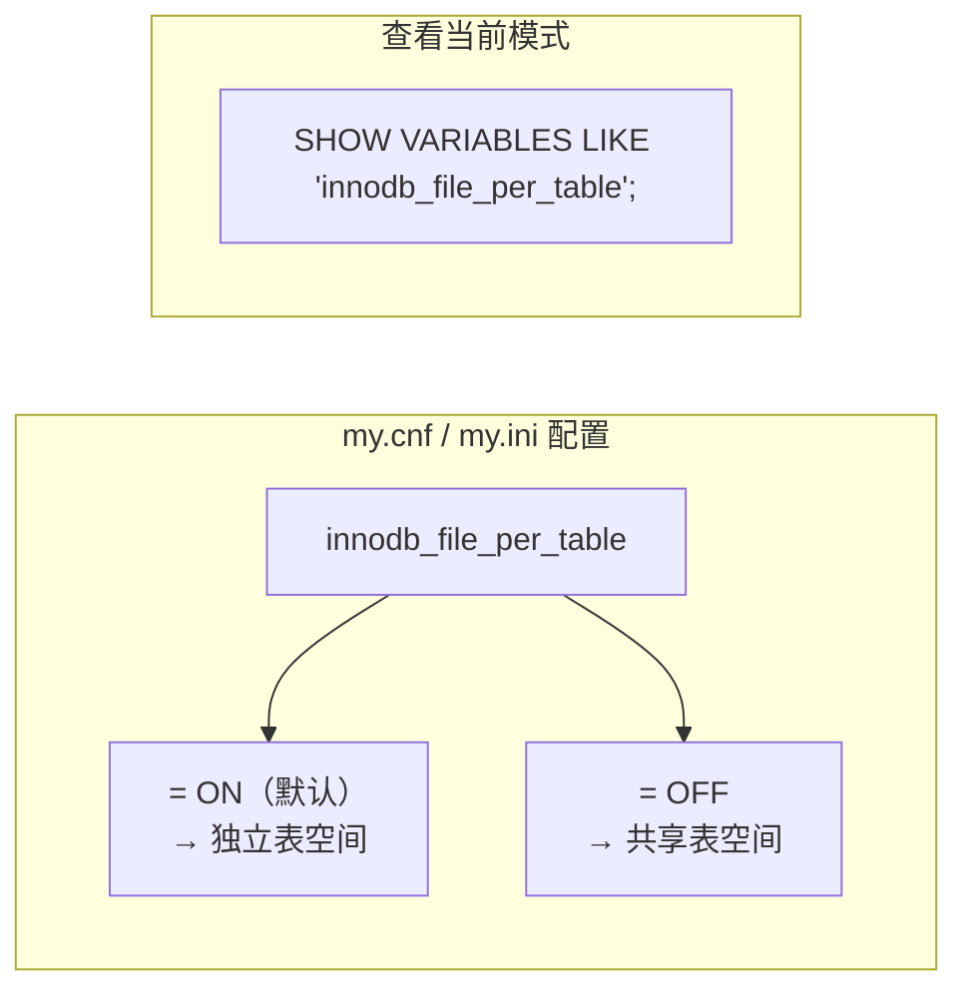

---

### 3.5 三种方式对比总结

| 数据库 | 默认方式 | 是否可配置 | 生产推荐 |
|--------|---------|-----------|---------|
| PostgreSQL | 独立表空间 | 有限 | 独立 |
| Oracle | DBMS自管理 | 可调 | 自管理 |
| SQL Server | DBMS自管理 | 可调 | 自管理 |
| **MySQL** | **独立表空间** | ✅ 灵活切换 | **独立表空间** |

> 💡 **MySQL 小贴士**：MySQL 5.6.6 之后默认使用 **独立表空间**（`innodb_file_per_table=ON`），这也是生产环境的推荐配置。共享表空间（ibdata1）主要用于存储数据字典、undo log 等系统数据。
---

## 四、什么是数据块？

### 4.1 快递柜类比

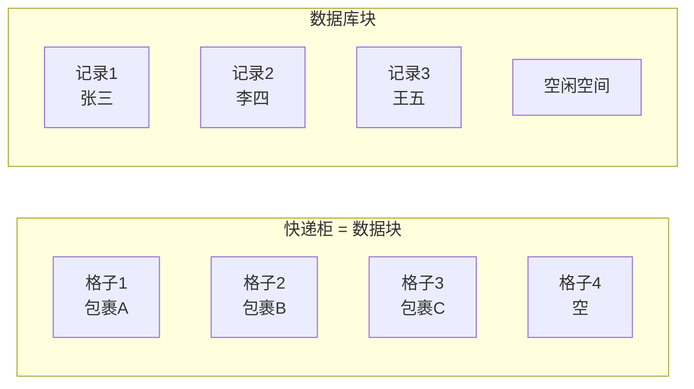

### 4.2 核心概念

> **数据库每次I/O，不是读一条记录，而是读整个块！**

| 概念 | 说明 | 大小举例 |
|------|------|---------|
| 物理块 | 操作系统读写的最小单位 | 4KB、8KB |
| 数据块 | 数据库读写的最小单位 | 8KB、16KB |
| 记录 | 表中的一行数据 | 不定 |

---

## 五、定长记录 vs 变长记录

### 5.1 对比图

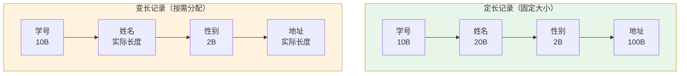

### 5.2 详细对比

| 对比项 | 定长记录 | 变长记录 |
|--------|---------|---------|
| 存储方式 | 固定大小，预先分配 | 按实际长度分配 |
| 查找速度 | ✅ 极快（直接计算位置） | ❌ 较慢（需要遍历） |
| 空间利用 | ❌ 浪费（varchar也占满） | ✅ 节省 |
| 修改操作 | ✅ 简单（原地覆盖） | ❌ 复杂（可能放不下） |
| 适用场景 | 字段长度固定 | 字段长度差异大 |

### 5.3 生活例子

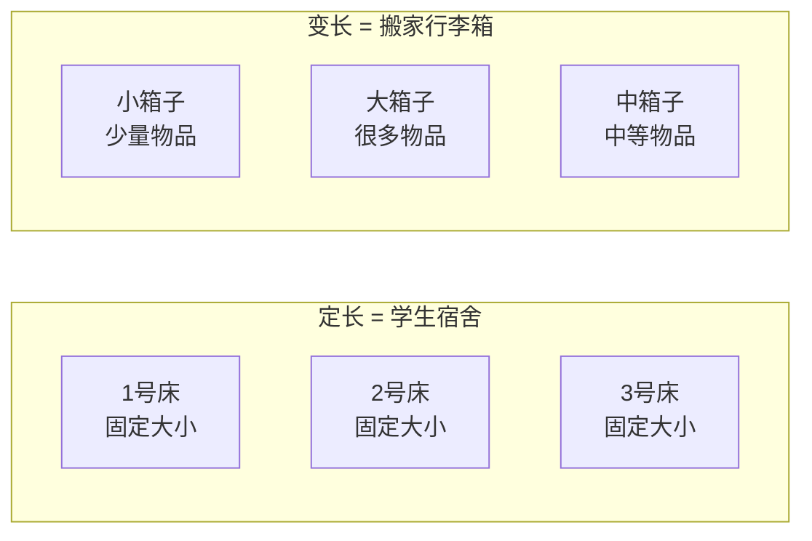

---

## 六、块的内部组织

### 6.1 定长记录块

```mermaid
flowchart TB
    subgraph 定长块["定长记录块结构"]
        H[块头<br/>--------<br/>块ID、时间戳<br/>记录偏移量、空闲指针]
        R0[记录0<br/>20180001|李勇|男|2000-3-8|信息安全]
        R1[记录1<br/>20180002|刘晨|女|1999-9-1|计算机]
        R2[记录2<br/>已删除记录]
        R3[记录3<br/>20180004|张立|男|2000-1-8|计算机]
        FS[空闲空间]
    end
    
    H --> R0 --> R1 --> R2 --> R3 --> FS
```

**操作方式：**
- 插入：直接找空位放
- 删除：标记为删除，回收空间
- 修改：原地覆盖

### 6.2 变长记录块

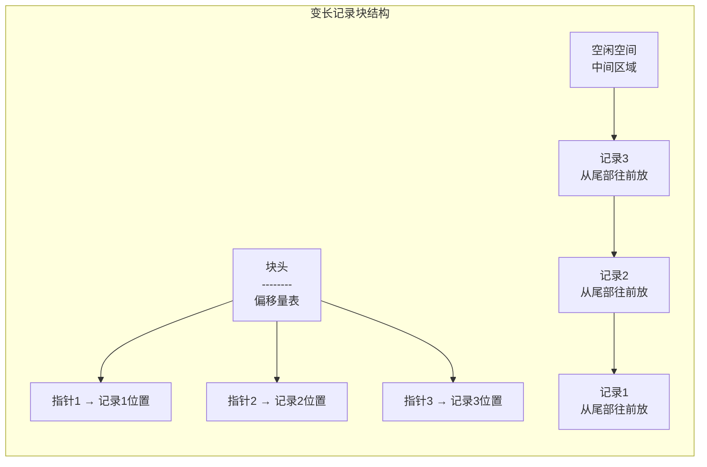

**操作方式：**
- 插入：从空闲空间尾部分配
- 删除：标记删除，移动其他记录保持连续
- 修改：可能触发记录迁移

---

## 七、关系表的五种存储方式

### 7.1 总览对比表

| 存储方式 | 核心思想 | 插入速度 | 查询速度 | 更新速度 | 适用场景 |
|---------|---------|---------|---------|---------|---------|
| 堆存储 | 乱放 | ✅ 极快 | ❌ 极慢 | ❌ 慢 | 只写不查（日志） |
| 顺序存储 | 按Key排序 | ❌ 慢 | ✅ 快 | ❌ 慢 | 范围查询多 |
| 聚簇存储 | 关联数据放一起 | ⚠️ 一般 | ✅✅ 很快 | ⚠️ 一般 | 多表连接查询 |
| B+树存储 | 平衡树索引 | ⚠️ 一般 | ✅✅ 很快 | ⚠️ 一般 | 通用场景 |
| 哈希存储 | 哈希函数定位 | ✅ 快 | ✅✅ 极快 | ✅ 快 | 等值查询 |

### 7.2 堆存储图解

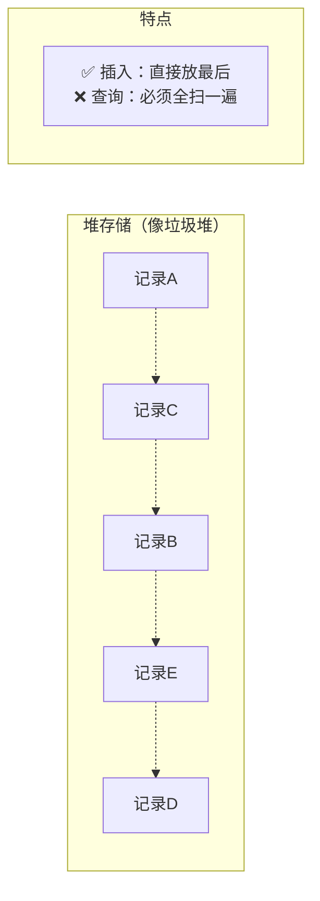

### 7.3 顺序存储图解

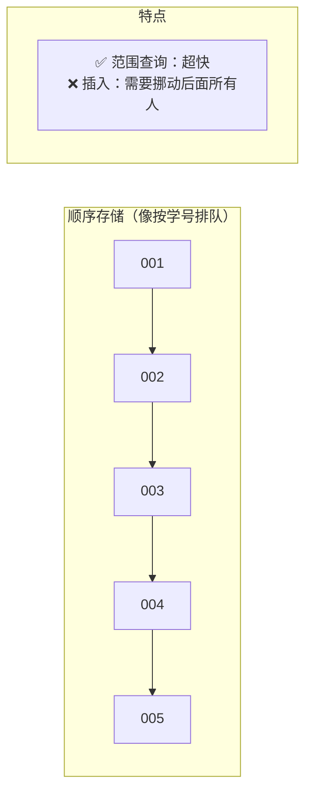

### 7.4 聚簇存储（重点）

**这是本章最重要的概念！**

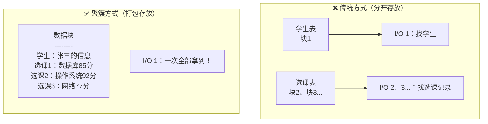

**聚簇存储结构示例：**

```mermaid
flowchart LR
    subgraph 物理块["一个物理块的内容"]
        H[块头]
        S[20180001|李勇|男|2000-3-8|信息安全]
        SC1[20180001|81001|85]
        SC2[20180001|81002|96]
        SC3[20180001|81003|87]
        S2[20180002|刘晨|女|1999-9-1|计算机]
        SC4[20180002|81001|80]
        SC5[20180002|81002|98]
        FS[空闲空间]
    end
    
    H --> S --> SC1 --> SC2 --> SC3 --> S2 --> SC4 --> SC5 --> FS
```

> **一句话总结聚簇：把“学生”和“这个学生的所有选课记录”钉在一起放，一次读取全部拿到！**

---

## 八、什么是索引？（核心中的核心）

### 8.1 索引的本质

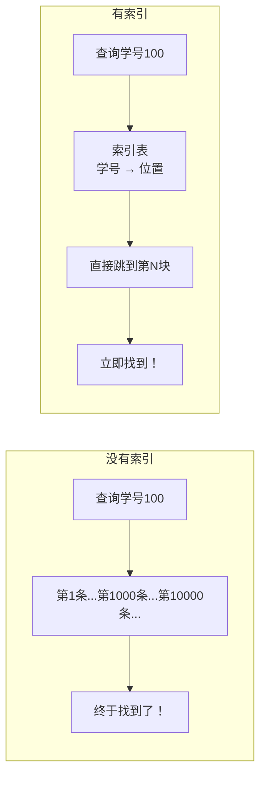

### 8.2 生活类比

| 场景 | 无索引 | 有索引 |
|------|--------|--------|
| 图书馆找书 | 一排排找 | 查目录→直接去书架 |
| 通讯录找人 | 从头翻到尾 | 按拼音首字母找 |
| 字典查词 | 一页页翻 | 按拼音/部首查 |

### 8.3 索引的代价

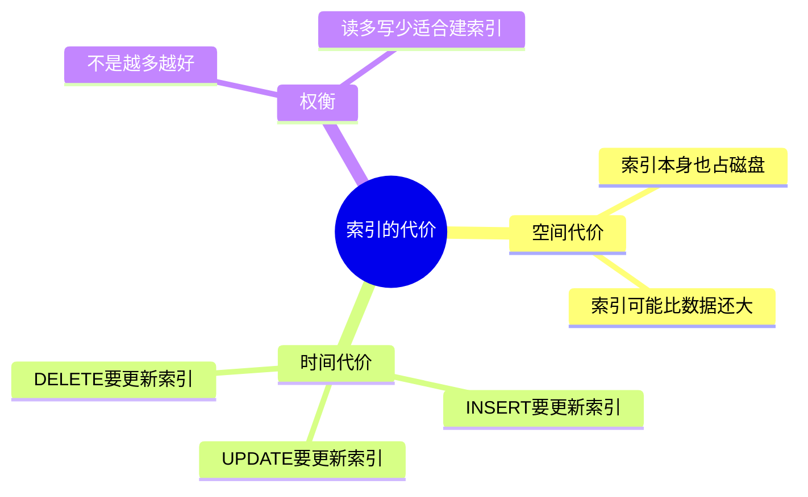

---

## 九、稠密索引 vs 稀疏索引

### 9.1 对比图

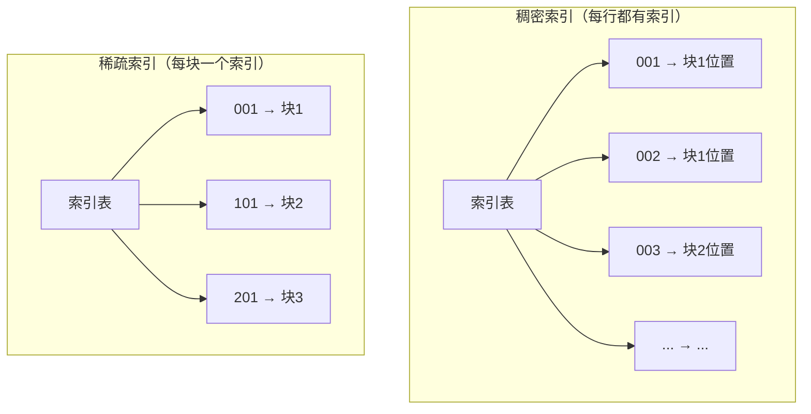

### 9.2 对比表

| 对比项 | 稠密索引 | 稀疏索引 |
|--------|---------|---------|
| 索引条目数 | = 记录数 | = 块数 |
| 空间占用 | 大 | 小（只有1/几十） |
| 查找速度 | 极快（直接定位） | 快（先找块，再块内找） |
| 适用场景 | 记录少、追求速度 | 记录多、节省空间 |

---

## 十、B+树索引（现代数据库的基石）

### 10.1 B+树结构图

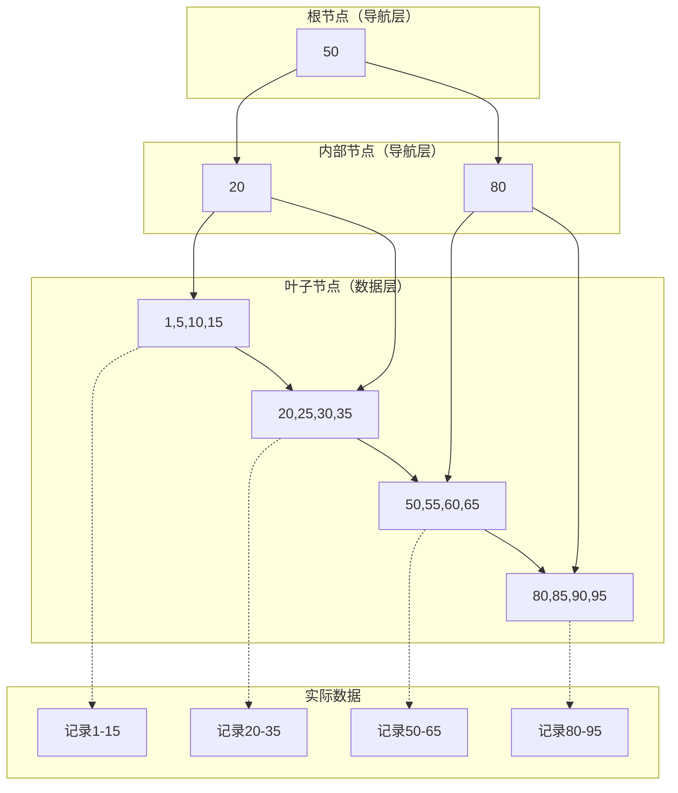

### 10.2 B+树的四大特点

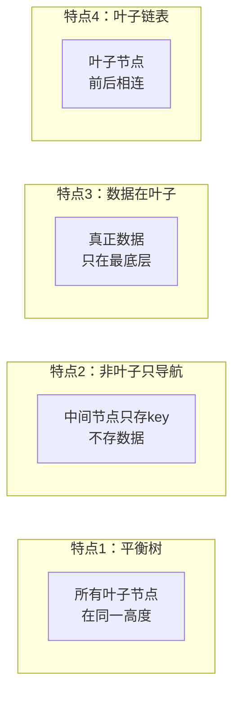

### 10.3 B+树范围查询演示

```sql
-- 查询学号 25 到 75 之间的学生
SELECT * FROM Student WHERE Sno BETWEEN 25 AND 75;
```

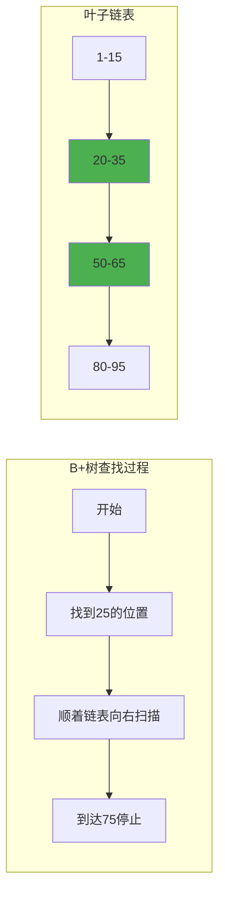

### 10.4 B+树 vs 其他结构对比

| 对比项 | 数组 | 链表 | 二叉搜索树 | B+树 |
|--------|------|------|-----------|------|
| 等值查询 | O(n) | O(n) | O(log n) | O(log n) |
| 范围查询 | O(n) | O(n) | O(k log n) | O(log n + k) |
| 插入 | O(n) | O(1) | O(log n) | O(log n) |
| 磁盘IO | 多 | 多 | 多 | **极少** |
| 实际应用 | 很少 | 很少 | 内存中 | **数据库主流** |

---

## 十一、哈希索引（通俗详解）

### 11.1 核心思想：像查字典一样直接跳转

想象你要在**一万张学生卡**里找到“学号 10086”的同学。

- **普通方法**（B+树）：按学号排序，先翻到中间，再决定往前还是往后，反复几次找到。
- **哈希方法**：直接计算 `10086 ÷ 10 = 1008 余 6`，然后**直接去第 6 号柜子**拿卡。

这就是哈希索引的精髓：**用数学公式把“查找值”算成一个固定位置，直接跳过去**。

```mermaid
flowchart LR
    subgraph 输入
        ID[学号 10086]
    end
    
    subgraph 哈希函数
        H["Hash函数<br/>hash = id % 10<br/>(除以10取余数)"]
    end
    
    subgraph 哈希桶["哈希桶（存储位置数组）"]
        B0[桶0]
        B1[桶1]
        B2[桶2]
        B3[桶3  ... 桶9]
    end
    
    subgraph 数据
        D1["记录10086<br/>姓名：张三<br/>班级：计算机1班"]
    end
    
    ID -- 10086 --> H -- "10086 % 10 = 6<br/>去第6号桶" --> B1 -- "桶6里存的就是<br/>10086的记录" --> D1
```

**关键点**：
- 哈希函数是固定的（比如 `% 10`）
- 相同的输入 → 永远得到相同的桶编号
- 时间复杂度 **O(1)**：不管数据多大，一次计算 + 一次访问

---

## 11.2 哈希冲突：当两个人抢同一个柜子

### 问题是怎么发生的

哈希函数把不同的学号算成了同一个桶编号：

```
10086 % 10 = 6  → 去桶6
10096 % 10 = 6  → 也去桶6
10106 % 10 = 6  → 还是桶6
```

三个学号，**抢同一个柜子（桶6）**，这就是**哈希冲突**。

```mermaid
flowchart LR
    subgraph 冲突场景["多个学号 → 同一个桶"]
        ID1[10086] --> H["Hash<br/>10086 % 10 = 6"]
        ID2[10096] --> H2["Hash<br/>10096 % 10 = 6"]
        ID3[10106] --> H3["Hash<br/>10106 % 10 = 6"]
        H --> B1[桶6]
        H2 --> B1
        H3 --> B1
    end
```

桶6只有一个格子，怎么放三个人？

---

### 解决方案：拉链法（溢出链）

**核心思路**：桶里不直接存数据，而是存一个**链表的头指针**。冲突的数据全部挂在这个链表上。

```mermaid
flowchart LR
    subgraph 解决方式["拉链法"]
        B1[桶6] -- "存链表头指针" --> N1["节点A<br/>10086 | 张三"]
        N1 --> N2["节点B<br/>10096 | 李四"]
        N2 --> N3["节点C<br/>10106 | 王五"]
        N3 --> NULL["NULL"]
    end
```

**桶6的结构变化**：

| 状态 | 桶6里放的是什么 |
|------|----------------|
| 空桶 | NULL（空指针） |
| 存入10086后 | 指向节点A的指针 |
| 再存入10096后 | 仍指向节点A，但节点A→节点B |
| 再存入10106后 | 仍指向节点A，链表变长：A→B→C |

---

### 查找过程（查学号 10096）

```mermaid
flowchart TD
    Start[开始查找 10096] --> Step1["① 计算哈希<br/>10096 % 10 = 6"]
    Step1 --> Step2["② 去桶6，得到链表头指针"]
    Step2 --> Step3["③ 检查节点A<br/>是10086吗？"]
    Step3 -->|否| Step4["④ 沿指针到节点B<br/>是10096吗？"]
    Step4 -->|是| Step5["⑤ 命中！取出李四"]
```

**分步说明**：

| 步骤 | 操作 | 结果 |
|------|------|------|
| 1 | 计算 `10096 % 10` | = 6 |
| 2 | 去桶6，拿到链表头 | 指向节点A（10086） |
| 3 | 对比节点A的学号 | 10086 ≠ 10096，继续 |
| 4 | 沿指针到节点B | 学号10096 → **匹配** |
| 5 | 取出节点B中的姓名 | 李四 |

---

### 插入过程（新增学号 10116）

```mermaid
flowchart TD
    Start[插入 10116] --> Step1["① 计算哈希<br/>10116 % 10 = 6"]
    Step1 --> Step2["② 去桶6，沿链表走到最后"]
    Step2 --> Step3["③ 新建节点D<br/>10116 | 赵六"]
    Step3 --> Step4["④ 让节点C的指针指向D"]
```

**插入前**：`桶6 → A(10086) → B(10096) → C(10106) → NULL`

**插入后**：`桶6 → A(10086) → B(10096) → C(10106) → D(10116) → NULL`

---

### 拉链法的优缺点

| 优点 | 缺点 |
|------|------|
| ✅ 实现简单，容易理解 | ❌ 链表过长时，查找变慢 |
| ✅ 桶满了也能继续插入，无限制 | ❌ 每个节点需要额外存指针（内存开销） |
| ✅ 删除操作容易（改指针即可） | ❌ 节点在内存中不连续，CPU缓存命中率低 |

---

### 最坏情况：哈希函数选得不好

假设哈希函数是 `学号 % 10`，但所有学号都以 `6` 结尾：

```
10006, 10016, 10026, 10036, 10046, 10056, 10066, 10076, 10086, 10096 ...
```

**结果**：

```
桶6 → 10006 → 10016 → 10026 → 10036 → ... → 10096（链表极长）
桶0 → NULL
桶1 → NULL
...
```

| 问题 | 后果 |
|------|------|
| 所有数据挤在同一个桶 | 哈希索引退化成**单链表** |
| 查找时间复杂度 | 从理想的 O(1) 变成 **O(n)** |
| 性能 | 和全表扫描没区别 |

**解决最坏情况的方法**：
- 选择更好的哈希函数（能均匀分布数据）
- 动态扩容（桶数量翻倍，重新分布数据）
- 链表过长时转为红黑树（Java HashMap 的做法）

---

### 一句话总结

> **哈希冲突就像多个人抢同一个柜子，拉链法的解决方式是：柜子里不放东西，只放一张纸条，纸条上写着“去隔壁链上找我”。**
---

### 11.3 哈希索引 vs B+树索引（详细对比）

| 对比项 | 哈希索引 | B+树索引 |
|--------|---------|---------|
| **等值查询**<br>`where id = 10086` | ✅✅ **极快**<br>一次计算直接定位 | ✅ 快<br>但需要logN次比较 |
| **范围查询**<br>`where id between 10000 and 20000` | ❌ **完全不支持**<br>因为哈希函数打乱了顺序，10086和10087可能在不同桶 | ✅✅ **极快**<br>叶子节点是双向链表，找到起点后顺序遍历 |
| **排序查询**<br>`order by id` | ❌ **不支持**<br>哈希桶是无序的 | ✅✅ **极快**<br>叶子节点天然有序 |
| **模糊查询**<br>`where name like '张%'` | ❌ **不支持**<br>无法对前缀哈希 | ✅ 支持<br>可以利用最左前缀 |
| **内存占用** | 较少<br>只需要存哈希值和指针 | 较多<br>需要存完整键值+指针 |
| **哈希冲突处理** | 需要额外机制<br>（拉链法/开放地址法） | 无此概念 |
| **适用场景** | 精确匹配查询<br>比如：缓存系统(Memcached)、等值JOIN | **通用场景**<br>绝大多数数据库主索引 |

---

### 11.4 哈希索引 vs 稀疏索引（重点对比）

**先弄清楚这两个概念的关系**：

- **哈希索引**：按“哈希函数计算结果”组织数据（是一种索引**类型**）
- **稀疏索引**：只为**部分键值**建索引条目（是一种索引**密度**）

**它们是从不同维度分类的**，可以组合存在，但通常直接用**稠密哈希索引**。

| 对比项 | 哈希索引（稠密） | 稀疏索引 |
|--------|----------------|---------|
| **索引条目数量** | 每个数据行都有对应条目（间接通过桶） | 只给**部分块/页**建索引<br>比如每100条数据建1条索引 |
| **查找过程** | 算哈希 → 找到桶 → 沿链表找 | 二分查找索引表 → 找到所在块 → 块内顺序扫描 |
| **是否需要数据有序** | ❌ 不需要<br>哈希函数打乱顺序 | ✅ **必须**<br>索引按主键排序，数据也按该顺序存储 |
| **存储空间** | 中等<br>需要存哈希值+指针 | ✅ **非常小**<br>索引条目少（1%～10%的数据量） |
| **查找速度** | 等值查询极快 O(1) | 等值查询较快，但需要额外块内扫描 |
| **能否定位单行** | ✅ 能，且极快 | ❌ 不能直接定位单行<br>只能定位到块 |
| **典型例子** | HashMap、Memcached | 文件的辅助索引、某些数据库的非唯一索引 |

---

### 11.5 举个稀疏索引的例子

假设学生表按学号排序存储（每页存4条）：

| 页码 | 学号（页内最小） | 姓名 |
|------|----------------|------|
| 页0 | 10000 | 张一 |
| 页0 | 10001 | 张二 |
| 页0 | 10002 | 张三 |
| 页0 | 10003 | 张四 |
| 页1 | 10004 | 李一 |
| 页1 | 10005 | 李二 |
| 页1 | 10006 | 李三 |
| 页1 | 10007 | 李四 |

**稀疏索引**（只存每页的最小学号）：

| 索引键（页内最小学号） | 页码 |
|----------------------|------|
| 10000 | 页0 |
| 10004 | 页1 |

**查找学号 10005**：
1. 在稀疏索引中找 ≤ 10005 的最大键 → 10004
2. 读入页1（10004~10007）
3. 在页内顺序扫描找到 10005

**对比哈希索引**：
- 哈希索引：10005 → 直接算哈希 → 一次拿到
- 稀疏索引：10005 → 两次查找（索引表+页内扫描）

---

### 11.6 总结：什么时候用哪种？

| 场景 | 推荐索引 | 理由 |
|------|---------|------|
| 用户登录（`where phone = '138...'`） | **哈希索引** | 精确匹配，最快 |
| 商品订单查询（`where order_id > 100000`） | **B+树索引** | 需要范围查询 |
| 按时间范围统计报表（`where date between ...`） | **B+树索引** | 排序+范围 |
| 缓存系统（Redis/Memcached） | **哈希索引** | 等值查询为主 |
| 文件系统的大文件索引（磁盘块定位） | **稀疏索引** | 节省空间，块内顺序扫描可接受 |
| 数据库的辅助索引（非聚簇索引） | **B+树（稠密或稀疏）** | 通用性强 |

**一句话口诀**：  
- **等值查找用哈希**（快准狠）  
- **范围排序用B+树**（灵活稳）  
- **索引想省空间用稀疏**（条目少）

---

### 11.3 哈希 vs B+树

| 对比项 | 哈希索引 | B+树索引 |
|--------|---------|---------|
| 等值查询 | ✅✅ 极快 | ✅ 快 |
| 范围查询 | ❌ 不支持 | ✅✅ 极快 |
| 排序查询 | ❌ 不支持 | ✅✅ 极快 |
| 模糊查询 | ❌ 不支持 | ✅ 支持 |
| 内存占用 | 较少 | 较多 |
| 适用场景 | 精确匹配 | 通用场景 |

---

## 十二、位图索引

### 12.1 工作原理

**适用场景：低基数字段（取值很少）**

```mermaid
flowchart TB
    subgraph 原始数据
        R1["张三 | 男"]
        R2["李四 | 女"]
        R3["王五 | 男"]
        R4["赵六 | 女"]
        R5["钱七 | 男"]
    end
    
    subgraph 位图索引["位图索引"]
        B1["性别=男: [1,0,1,0,1]"]
        B2["性别=女: [0,1,0,1,0]"]
    end
```

### 12.2 位图索引优势

```sql
-- 查询：男生且选了数据库课的
-- 位图索引可以用位运算瞬间完成！
```

| 性别=男 | 课程=数据库 | AND结果 |
|---------|------------|---------|
| 1 | 1 | 1 |
| 0 | 0 | 0 |
| 1 | 0 | 0 |
| 0 | 1 | 0 |
| 1 | 1 | 1 |

> **位运算一次完成，极快！**

### 12.3 索引类型总结表

| 索引类型 | 最优场景 | 最差场景 | 形象比喻 |
|---------|---------|---------|---------|
| B+树 | 范围查询、排序 | 频繁插入更新 | 图书馆分类目录 |
| 哈希 | 等值查询 | 范围查询 | 快递柜取件码 |
| 位图 | 低基数字段 | 高基数字段 | 签到表 |

---

## 十三、面试/考试高频题

### Q1：为什么B+树适合数据库？

```mermaid
flowchart LR
    Q[B+树为什么强？] --> A1[✅ 高度低<br/>3-4层能存千万数据]
    Q --> A2[✅ IO次数少<br/>每次读一个节点]
    Q --> A3[✅ 范围查询快<br/>叶子链表连续]
    Q --> A4[✅ 查询稳定<br/>所有查询走同样层数]
    Q --> A5[✅ 磁盘友好<br/>节点大小=块大小]
```

### Q2：哈希为什么不适合范围查询？

```mermaid
graph LR
    subgraph 原始数据["原始数据（有序）"]
        O1[1] --> O2[2] --> O3[3] --> O4[4] --> O5[5]
    end
    
    subgraph 哈希后["哈希后（乱序）"]
        H1[hash1=3] --> H2[hash2=1] --> H3[hash3=5] --> H4[hash4=2] --> H5[hash5=4]
    end
    
    NOTE[大小关系被打乱<br/>无法范围查询！]
```

### Q3：位图索引适合什么字段？

| 字段 | 取值个数 | 适合位图？ | 原因 |
|------|---------|-----------|------|
| 性别 | 2-3个 | ✅ 非常适合 | 位图极短，运算快 |
| 省份 | 30多个 | ✅ 适合 | 位图不太长 |
| 身份证号 | 10亿+ | ❌ 不适合 | 位图会巨大无比 |

---

## 十四、本章总结图

```mermaid
mindmap
  root((关系数据库<br/>存储技术))
    数据组织
      逻辑结构：数据库→表→行
      物理结构：文件→块→记录
      定长记录：快但浪费
      变长记录：省但复杂
    
    存储方式
      堆存储：乱放，插入快
      顺序存储：排序，范围快
      聚簇存储：关联数据打包
    
    索引技术
      B+树：通用、稳定、范围快
      哈希：等值极快
      位图：低基数、统计快
    
    核心目标
      减少磁盘IO
      加速数据查找
      平衡读写性能
```

---

## 十五、课后思考题

| 题号 | 问题 | 难度 |
|------|------|------|
| 1 | 为什么索引不能建太多？ | ⭐⭐ |
| 2 | B+树和哈希索引有什么区别？ | ⭐⭐⭐ |
| 3 | 为什么数据库读取是“按块读取”而不是“按行读取”？ | ⭐⭐ |
| 4 | 为什么B+树的叶子节点要连成链表？ | ⭐⭐⭐ |
| 5 | 什么场景适合位图索引？举个例子 | ⭐⭐ |
| 6 | 聚簇存储的优缺点分别是什么？ | ⭐⭐⭐ |

---

## 结束语

> **数据库性能优化的本质：如何更快地找到数据，并减少磁盘IO。**

这一章是后面学习的基础：
- 查询优化
- MySQL调优  
- SQL性能分析
- 索引设计

**真正理解了数据块、B+树、聚簇存储，数据库优化的大门就打开了！**